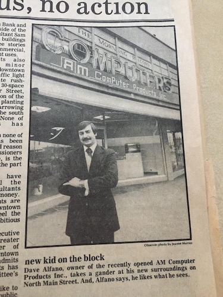

## Hello.

Currently working on education data visualizations using SQL, API’s, Google Apps Script and Data Studio.

## My tech timeline.

I've been around computers most of my life. In fact, my dad opened a retail computer store _AM Computer Products, Inc._ back in, I believe, 1980. Here he is outside the storefront in Southington, Connecticut. 



Growing up, I spent the weekends cleaning the office or just hanging out playing with a new gadget or game that arrived. As I got older, I worked during the summers installing Apple II/II+/IIe/IIc computers in schools throughout Connecticut (we were one of the first Apple Computer dealers in the state). After high school, I continued to work for the family business. By then we were selling and supporting many small and large businesses, along with the retail and education markets. I remember installing 3270 mainframe emulation cards inside of Macintosh SE computers. Does anyone remeber the Mac Cracker tool? The mid 90's brought consolidation to the computer reseller industry and my parents decided to sell the business. 

After sticking around with the new ownership for a bit, I decided to go to college to pursue a degree. I attended Tunxis Community College and the University of Hartford. I started as a Physics major, then switched to Math. I remember having to take a Computer Science course as one of my requirements, C++ was language. Being exposed to computers over the years, you would have thought I had some interest in programming, nope. Ugh, I still kick myself for not pursuing CS back then. The only thing a remember from that class was printed PowerPoint slides. Those were dark times in tech, Y2K happened, and the dot com bubble burst...

Whenever you commit to this repository, GitHub Pages will run [Jekyll](https://jekyllrb.com/) to rebuild the pages in your site, from the content in your Markdown files.

### Markdown

Markdown is a lightweight and easy-to-use syntax for styling your writing. It includes conventions for

```markdown
Syntax highlighted code block

# Header 1
## Header 2
### Header 3

- Bulleted
- List

1. Numbered
2. List

**Bold** and _Italic_ and `Code` text

[Link](url) and 
```

For more details see [Basic writing and formatting syntax](https://docs.github.com/en/github/writing-on-github/getting-started-with-writing-and-formatting-on-github/basic-writing-and-formatting-syntax).

### Jekyll Themes

Your Pages site will use the layout and styles from the Jekyll theme you have selected in your [repository settings](https://github.com/runmca/runmca.github.io/settings/pages). The name of this theme is saved in the Jekyll `_config.yml` configuration file.

### Support or Contact

Having trouble with Pages? Check out our [documentation](https://docs.github.com/categories/github-pages-basics/) or [contact support](https://support.github.com/contact) and we’ll help you sort it out.
